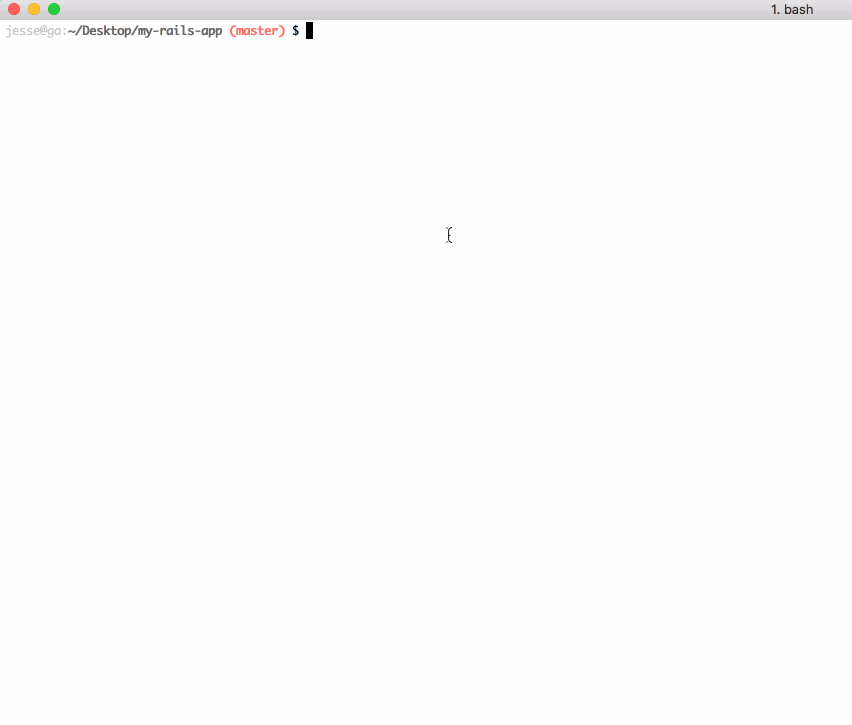

# Deploying Your First App

## Important

If your rails app root directory is not the same as your git root directory,
you will need to move the rails app up a directory:



## Installing the Heroku Toolbelt

The Heroku toolbelt is a command line app that enables us to create new apps to
deploy, deploy code updates, and manage our server(s).

Follow the instructions on the
[Heroku Toolbelt site](https://toolbelt.heroku.com) to get it installed.

## Creating our App

The first time we want to deploy a new app, we need to tell Heroku to create a
new server.

We'll also define the URL at which we want the app to be hosted. You can pick any name. It will look like this in the URL: `your-app-name.herokuapp.com`.

Note: If you try to name your app something with underscores in it, you'll get this error from Heroku:

```
Name must start with a letter and can only contain lowercase letters, numbers,
and dashes.
```

To create your app:

```bash
$ cd app-directory
$ heroku create your-app-name
```

When we run `heroku create`, Heroku will automatically add a new git remote
called `heroku`. This doesn't actually move your code anywhere -- it accomplishes just as much as `git remote add origin`.

> Note: If you type `heroku create` without a name afterward, it'll make up a name for you -- usually something goofy like `secure-wave-14641.herokuapp.com`. You can rename your app with `heroku apps:rename your-new-app-name`

## Deploying the App

To actually deploy our code onto the new server, we simply push to this new remote:

```bash
$ git push heroku master
```

> If you would like to push from a different local branch, you would run `$ git push heroku other-branch-name:master`

After doing this, you'll see a lot of stuff printed out in your Terminal. You're watching Heroku run `bundle install` and run the commands necessary to set up a Rails app.

## Add the `rails_12factor` gem to your app

[This gem](http://12factor.net/) helps manage your assets, and does some other things. Not including it is a *very* common source of Heroku deployment errors.

Include this snippet in your `Gemfile`:

```rb
gem "rails_12factor", group: :production
```

## Visiting Our Site

We could open our site manually by typing the URL into the browser, but Heroku
gives us a convenient tool to do this from our app's folder in the command line.

Simply run the following command to open the site in your default browser:

```bash
$ heroku open
```

You'll get an error page. No fear!

## Running Migrations on Heroku

The error is because Heroku creates a Postgres database for our app, but doesn't run
any migrations. To run our migrations on Heroku, we use the `heroku run`
command:

```bash
$ heroku run rails db:migrate
```

In general, the `heroku run` command will take the command immediately after it
and run it on your Heroku server, instead of locally.

After migrating, you should be able to successfully visit your app in the browser. The only downside is it will have no seed data.

## Seed your app

So: The usual command for *migrating* is `rails db:migrate`, and to migrate your Heroku database you type `heroku run rails db:migrate`.

Keeping that in mind, if the usual command for *seeding* is `rails db:seed`, how would you seed your Heroku database?

## Show logs

To be able to see your server log (what you normally see in Terminal when running a Rails app), use `heroku logs`. Some more information:

```bash
$ heroku logs             # print the most recent entries and quit
$ heroku logs -n 2000     # print the 2000 most recent entries and quit
$ heroku logs -t          # 'tail' - print the most recent entries and continue to print new ones until we quit using ctrl-c
```
